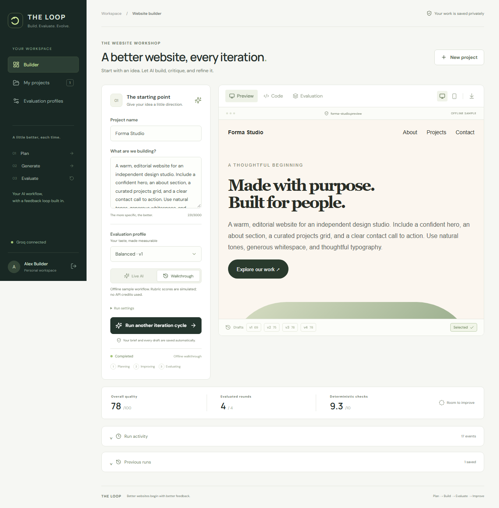
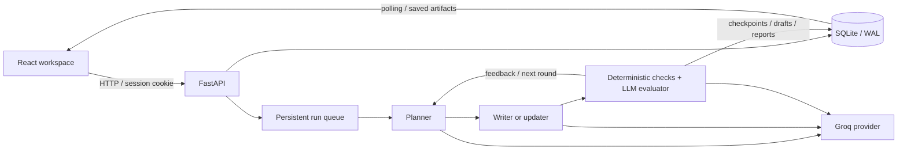

# THE LOOP

An evaluator-driven AI website builder. Describe a website, let the planner create a brief, and watch the writer, evaluator, and updater improve it over multiple rounds. Every draft, score, and profile version is saved so the result can be inspected and revisited.

React + TypeScript frontend · FastAPI backend · SQLite persistence · Groq inference



## What you can do

- Create a private account and save projects across sessions.
- Run the original **plan → generate → evaluate → improve** workflow in the background.
- Preview desktop/mobile layouts in a sandbox, inspect source, and download standalone HTML.
- Compare every evaluated draft and keep the highest-scoring result when an update regresses.
- Inspect deterministic checks, five rubric scores, reviewer feedback, token usage, request IDs, and timings.
- Create personal evaluation profiles; edit criteria, apply AI feedback, inspect diffs, and restore previous versions without erasing history.
- Try an explicitly labelled offline walkthrough without API credits. Its HTML and design rubric are fixtures; deterministic checks run against the sample HTML.

## Local setup

Requires Python 3.12 and Node.js 22+.

```powershell
python -m venv .venv
.venv\Scripts\Activate.ps1
pip install -r requirements-api.txt
Copy-Item .env.example .env
cd frontend
npm ci
cd ..
python scripts/dev.py
```

On macOS/Linux, activate with `source .venv/bin/activate` and copy with `cp .env.example .env`.

Open **http://127.0.0.1:5180**, create your account, and choose **Walkthrough** for an offline trial. Add your own `GROQ_API_KEY` in `.env` and restart the API to enable **Live AI**. The key is never sent to the browser. API documentation is at **http://127.0.0.1:8000/docs**.

You can also start the services separately:

```sh
python -m uvicorn backend.main:app --host 127.0.0.1 --port 8000
# In another terminal:
cd frontend
npm run dev
```

The original Streamlit interface is still available with `streamlit run app.py`. It uses JSON file profiles; the full-stack application has separate per-account profiles in SQLite.

## Architecture



The shared engine lives in `core/pipeline.py`; existing `nodes/` retain their individual responsibilities. The API snapshots the brief and profile criteria when a run starts. Editing a profile later cannot alter an in-progress evaluation.

The worker persists events and HTML after each stage. Queued jobs survive a restart. In-flight jobs become **interrupted**, with saved drafts available; the application avoids silently replaying paid inference calls. A single worker serializes requests to reduce provider contention. Cancellation is checked between stages and during rate-limit waits; an HTTP request already in flight finishes or times out first.

## Evaluation

```text
overall reward = 0.40 × deterministic score / 10
               + 0.40 × weighted design rubric / 10
               + 0.20 × description match / 10
```

The design rubric weights layout 25%, typography 25%, responsiveness 20%, and visual design 30%. Every run performs at least three complete evaluation rounds. Quality success requires reward ≥ 0.90, deterministic quality ≥ 9/10 with no issues, and every rubric dimension ≥ 8/10. Runs also stop at the selected iteration limit or a plateau. **Completed** means the bounded search finished; it does not guarantee the quality gate passed.

Deterministic checks cover HTML structure, h1 count, heading hierarchy, semantic landmarks, alt attributes, viewport, responsive implementation, static JavaScript delimiters, overflow patterns, basic accessibility, and requested-section keywords. These are **static heuristics**, not a substitute for a rendered-browser accessibility or usability audit. The API disables outbound resource probes; generated HTML cannot make the backend fetch arbitrary URLs. Passing static checks does not establish that external assets load or that a visual layout is correct.

## Persistence and account boundaries

SQLite stores users, hashed sessions, projects, runs, iterations, events, profiles, and profile versions. Passwords use scrypt with per-password salts. Sessions use opaque random tokens in HttpOnly/SameSite cookies; only their hashes are stored. Every project, run, artifact, and profile endpoint checks ownership. Profile writes use version checks to reject stale updates from another session. Generated HTML is displayed in an iframe with an opaque sandbox origin and restricted network/form capabilities.

The default database is `data/loop.sqlite3`, excluded from Git. Back it up with SQLite's backup API or while the app is stopped; do not copy a live WAL database without its associated journal. File-based seed profiles do not include account data.

## Tests

```sh
python -m unittest discover -v
python test_smoke.py
cd frontend
npm run build
npx playwright install chromium
npm test
```

Python tests cover provider failures, retry delays, schemas, evaluator checks, iteration selection, cancellation, profile migration/rollback, auth, ownership boundaries, stale writes, persistence after reopening the database, and downloads. Browser tests exercise registration, offline generation, draft inspection, persistence on reload, profile rollback, and mobile overflow. CI runs the Python suite, TypeScript build, and Chromium workflow without a Groq key.

For an opt-in check of the actual provider path, run `python scripts/verify_live.py` against the local API. This creates a verification account/project and consumes Groq tokens for three full rounds; CI never runs it.

## Deployment

```sh
docker compose up --build
```

Open **http://localhost:8000**. Requires Docker Compose 2.24+ for the optional `.env` file. The multi-stage image builds the frontend and serves it from FastAPI; application data lives in the `loop-data` volume. Server model settings are passed from `.env`, never baked into the image. For HTTPS deployment, set `LOOP_SECURE_COOKIES=true` and `LOOP_ORIGINS` to your actual origin. Use **one API process** with the current SQLite/worker design. The frontend build can also be served locally with FastAPI after `npm run build` and an API restart.

## Current limits and next steps

This is a self-hostable portfolio application, with explicit limits: the job worker is in-process and single-instance; email verification/password recovery and distributed workers are not implemented; static evaluation does not replace browser measurements. For higher concurrency, move jobs to a dedicated queue and persistence to PostgreSQL. For stronger evaluation, add isolated browser measurements for overflow, resource loading, JavaScript errors, and accessibility. Provider quotas still constrain speed; retries honor Groq cooldowns rather than promising instant generation.

Do not commit `.env`, account databases, or real user run traces. Default model IDs and output budgets are configurable through environment variables; check provider capabilities when replacing a model.
